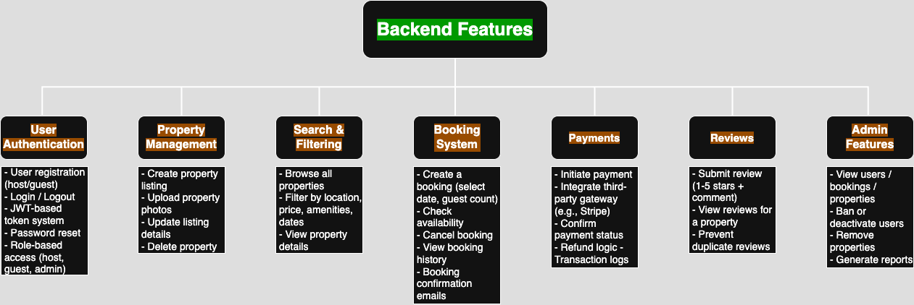

# 🏡 Airbnb Clone Backend

## 🎯 Project Objective

The Airbnb Clone backend is designed to replicate the core functionalities of a rental marketplace platform like Airbnb. This system handles user authentication, property management, bookings, secure payments, and more. It is built to be scalable, secure, and maintainable using modern backend technologies.

---

## 📚 Overview

This backend application serves as the backbone of the Airbnb Clone. It provides RESTful APIs, database operations, and integrations that allow frontend clients to manage users, listings, bookings, payments, and more. 

---

## 🔑 Core Functionalities

### 1. User Management
- **Registration & Login**: Secure authentication using JWT, with support for OAuth providers (Google, Facebook).
- **Roles**: Users can register as **guests**, **hosts**, or **admins**.
- **Profile Management**: Update personal info, profile photos, contact preferences.

### 2. Property Listings
- **Create Listings**: Hosts can post new properties with descriptions, location, pricing, and amenities.
- **Update/Delete Listings**: Listings can be modified or removed by their owners.
- **Photo Uploads**: Supports uploading and storing property images.

### 3. Search & Filtering
- Search by location, price range, guest capacity, and amenities.
- Pagination for efficient result handling and UI performance.

### 4. Booking System
- **Create Bookings**: Guests can book available properties for selected dates.
- **Date Validation**: Prevents double-bookings and overlaps.
- **Cancel Bookings**: Role-based cancellation features.
- **Status Tracking**: Status values include: `pending`, `confirmed`, `canceled`, `completed`.

### 5. Payments
- Integration with third-party payment gateways (e.g., Stripe, PayPal).
- Secure transaction handling.
- Automatic host payouts post-booking.
- Multi-currency support.

### 6. Reviews and Ratings
- Guests can review and rate properties.
- Reviews linked to bookings to prevent spam or abuse.
- Hosts can respond to reviews.

### 7. Notifications
- Email and in-app notifications for:
  - Booking confirmations
  - Cancellations
  - Payment updates

### 8. Admin Dashboard
- Monitor and manage users, listings, bookings, and transactions.
- View metrics and reports.

---

## 🛠️ Technical Stack

### Backend
- **Framework**: Django REST Framework (or FastAPI as an alternative)
- **Authentication**: JWT + OAuth
- **Database**: PostgreSQL
- **Storage**: Cloud (e.g., AWS S3 or Cloudinary for file uploads)
- **Testing**: Pytest or Django Test Framework

### APIs
- RESTful endpoints for all core functionalities.
- Follows best practices for HTTP methods and status codes.

---

## 🚀 Non-Functional Requirements

- **Security**: 
  - Password hashing
  - Input sanitization
  - Rate limiting & firewalls

- **Scalability**:
  - Modular service architecture
  - Load balancing readiness

- **Performance**:
  - Caching with Redis
  - Optimized queries

- **Testing**:
  - Unit & integration tests
  - Automated API tests

---

## 📁 Project Structure (Example)

airbnb-clone-backend/
├── api/
│ ├── users/
│ ├── listings/
│ ├── bookings/
│ ├── payments/
│ └── reviews/
├── database/
│ └── schema.sql
├── tests/
├── requirements.txt
└── README.md


---

## 📌 Getting Started

1. Clone the repository.
2. Set up your virtual environment and install dependencies.
3. Configure `.env` for DB and API keys.
4. Run database migrations.
5. Start the development server.
6. Run test suite to ensure stability.

---

## 🧪 Testing

```bash
pytest
# or
python manage.py test
```

---

## 🌟 Features

